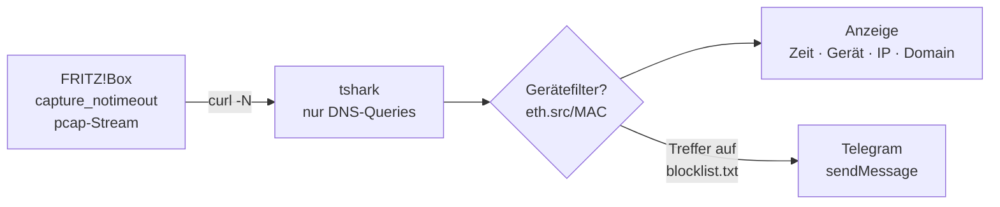

# lauschbox 📡


TUI-Tool (Bash) zum Loggen der DNS-Aufrufe einer FRITZ!Box — mit Gerätefilter,
Sperrliste und Telegram-Benachrichtigung bei Treffern.

Die FRITZ!Box hat **kein natives DNS-Query-Log**. lauschbox nutzt deshalb den
Paketaufzeichnungs-Endpunkt der Box (pcap-Stream) und filtert clientseitig mit
`tshark` die DNS-Queries heraus.

## Screenshots

Hauptmenü:

```
 _                      _     _
| | __ _ _   _ ___  ___| |__ | |__   _____  __
| |/ _` | | | / __|/ __| '_ \| '_ \ / _ \ \/ /
| | (_| | |_| \__ \ (__| | | | |_) | (_) >  <
|_|\__,_|\__,_|___/\___|_| |_|_.__/ \___/_/\_\


  Fritzbox: konfiguriert ✅   Telegram: konfiguriert ✅

  [1] 🔌 Verbindung Fritzbox
  [2] ✈️  Verbindung Telegram
  [3] 📱 Gerätefilter
  [4] 📡 DNS Logging
  [5] 🚫 Sperrliste anzeigen
  [6] 👋 Ende

  Auswahl [1-6] + Enter:
```

DNS-Logging-Ansicht (Zeitstempel grau, Gerätename hellblau, IP dunkelblau,
Domain weiß — Sperrlisten-Treffer rot; Statusleiste unten: grün = An, rot = Aus):

```
 _                      _     _
| | __ _ _   _ ___  ___| |__ | |__   _____  __
| |/ _` | | | / __|/ __| '_ \| '_ \ / _ \ \/ /
| | (_| | |_| \__ \ (__| | | | |_) | (_) >  <
|_|\__,_|\__,_|___/\___|_| |_|_.__/ \___/_/\_\


  16:58:19 smarthome 192.168.179.100 eu-west-1.amazonaws.com
  16:58:21 iPad      192.168.179.126 iPad.local
  16:58:24 Mac       192.168.179.129 heise.de        ← rot: Treffer auf blocklist.txt
  16:58:24 Mac       192.168.179.129 example.com
  16:58:27 iPhone    192.168.179.154 time.apple.com

  📡 Logging läuft (Interface 1-lan) — Gerätefilter: Alle Netzwerkgeräte
  <g>-Gerätefilter An   <e>-Gerätefilter ändern   <s>-Sperrliste An   <t>-Telegram An   <x>-Hauptmenü
```



## Features

- 🔌 Fritzbox-Zugang konfigurieren (IP, Benutzer, Passwort) → `.fritzbox.env`
- ✈️ Telegram-Bot konfigurieren (Token, Chat-ID) → `.telegram.env`
- 📱 Gerätefilter: verbundene Geräte live von der Box auflisten, Mehrfachauswahl → `.devices.env`
- 📡 DNS-Live-Logging: Zeitstempel, Gerätename, IP, Domain — scrollbar (Pfeile/PgUp/PgDn/Home/Ende/Mausrad); beim Hochscrollen pinnt die Ansicht, das Log läuft im Hintergrund weiter
- 🚫 Sperrliste (`blocklist.txt`): an/aus, Treffer werden **immer rot** markiert; Übersicht (Menü 5) scrollbar
- ✈️ Telegram-Push bei jedem Sperrlisten-Treffer (sofort, ohne Cooldown)
- 🎨 Farbschema Catppuccin Macchiato, Banner fixiert oben auf allen Screens

## Voraussetzungen

**FRITZ!Box:**
- FRITZ!Box-Benutzer mit Passwort (nicht „nur Kennwort"):
  `http://fritz.box` → *System → FRITZ!Box-Benutzer → Benutzer hinzufügen*,
  Recht **„FRITZ!Box Einstellungen“**
- TR-064 freischalten: *Heimnetz → Netzwerk → Netzwerkeinstellungen →
  „Zugriff für Anwendungen zulassen“*

**Werkzeuge** (werden beim Start geprüft, inkl. Installationshinweis):

| Tool | macOS (Homebrew) | Debian/Ubuntu |
|---|---|---|
| figlet | `brew install figlet` | `sudo apt-get install figlet` |
| curl | `brew install curl` | `sudo apt-get install curl` |
| tshark | `brew install wireshark` | `sudo apt-get install tshark` |
| python3 | `brew install python` | `sudo apt-get install python3` |

Läuft mit bash ≥ 3.2 (also auch mit dem macOS-System-Bash).

## Installation & Start

Einzeiler (macOS & Linux) — installiert das Script nach `~/.local/bin`,
legt `~/.config/lauschbox` an und lädt `blocklist.txt` und `lauschbox.env`
(Puffer-Limits) dorthin:

```bash
curl -fsSL https://forbidden-fruits.github.io/lauschbox/install.sh | sh
```

Konfigdateien (`.fritzbox.env`, `.telegram.env`, `.devices.env`) und die
`blocklist.txt` sucht lauschbox **zuerst im aktuellen Verzeichnis**, danach
unter `~/.config/lauschbox`. Neu angelegte Konfigdateien werden dort
gespeichert, wo sie gefunden wurden — bzw. in `~/.config/lauschbox`, wenn es
im aktuellen Verzeichnis noch keine gibt.

Oder klassisch:

```bash
git clone <repo-url> lauschbox
cd lauschbox
chmod +x lauschbox
./lauschbox
```

Website/Doku: <https://forbidden-fruits.github.io/lauschbox/>

Beim ersten Start: Menüpunkt **1** (Fritzbox-Zugang) und optional **2**
(Telegram) einrichten, dann **4** (DNS Logging).

## Nutzung

### Hauptmenü

| # | Funktion |
|---|---|
| 1 | 🔌 Verbindung Fritzbox (Zugangsdaten eingeben/überschreiben) |
| 2 | ✈️ Verbindung Telegram (Bot-Token + Chat-ID eingeben/überschreiben) |
| 3 | 📱 Gerätefilter (verbundene Geräte anzeigen, Mehrfachauswahl oder „Alle“) |
| 4 | 📡 DNS Logging (Live-Ansicht) |
| 5 | 🚫 Sperrliste anzeigen |
| 6 | 👋 Ende |

### Tasten im Logging

| Taste | Funktion |
|---|---|
| `g` | Gerätefilter an/aus (aus = alle Geräte loggen) |
| `e` | Gerätefilter ändern |
| `s` | Sperrliste an/aus (an = **nur Treffer** anzeigen) |
| `t` | Telegram an/aus (nur bei aktiver Sperrliste) |
| `x` | zurück zum Hauptmenü |
| `↑`/`↓` | eine Zeile scrollen |
| `PgUp`/`PgDn` | seitenweise scrollen |
| `Home`/`Ende` | an den Anfang / zurück zum Live-Ende |
| Mausrad | scrollen (3 Zeilen) |

Beim Hochscrollen **pinnt** die Ansicht: Neue Einträge laufen im Hintergrund
weiter (Ringpuffer) und werden in der Statuszeile gezählt — `Ende` kehrt zur
Live-Ansicht zurück. Banner oben und Statusleiste unten bleiben statisch.

Der Status der Toggle-Funktionen wird in der Leiste unten farbig angezeigt
(grün = An, rot = Aus). Beim Start der Ansicht wird der aktive Gerätefilter
mit Namen eingeblendet.

### Sperrliste (`blocklist.txt`)

Gesucht wird zuerst im aktuellen Verzeichnis, dann unter
`~/.config/lauschbox/blocklist.txt` (vom curl-Installer bereits dort
abgelegt). Eine Domain pro Zeile; Suffix-Matching — ein Eintrag matcht auch
alle Subdomains. `#` am Zeilenanfang = Kommentar. Groß-/Kleinschreibung egal.
Die Übersicht (Menü 5) ist scrollbar (Pfeile/PgUp/PgDn/Home/Ende/Mausrad);
eingelesen werden maximal `BLOCKLIST_MAX_LINES` Zeilen (s. `lauschbox.env`).

```
# Beispiel
example.com
tracking.example.org
```

### Telegram einrichten

1. Bot bei [@BotFather](https://t.me/BotFather) anlegen (`/newbot`) → Token
   im Format `123456789:AA…`
2. **Dem Bot einmal `/start` schicken** (sonst darf er dir nicht schreiben)
3. Chat-ID ermitteln: [@userinfobot](https://t.me/userinfobot) anschreiben
   (liefert deine User-ID) — oder dem Bot eine Nachricht schicken und
   `https://api.telegram.org/bot<TOKEN>/getUpdates` →
   `result[].message.chat.id`. Gruppen haben negative IDs (Bot muss Mitglied sein).

## Dateien

Alle Dateien werden zuerst im aktuellen Verzeichnis gesucht, dann unter
`~/.config/lauschbox`:

| Datei | Inhalt | Rechte |
|---|---|---|
| `.fritzbox.env` | `FB_IP`, `FB_USER`, `FB_PASS` | 600 |
| `.telegram.env` | `TG_TOKEN`, `TG_CHAT_ID` | 600 |
| `.devices.env` | `DEVICE_FILTER` (MACs oder `ALL`), `DEVICE_FILTER_NAMES` | 600 |
| `blocklist.txt` | Sperrliste (eine Domain pro Zeile) | — |
| `lauschbox.env` | Einstellungen: `LOG_MAX_LINES`, `BLOCKLIST_MAX_LINES` (je Default 1000) | — |

`lauschbox.env` wird vom curl-Installer mit den Defaults angelegt und begrenzt
den Speicherverbrauch: `LOG_MAX_LINES` = Zeilen im Ringpuffer der
Logging-Ansicht, `BLOCKLIST_MAX_LINES` = maximal eingelesene Zeilen der
`blocklist.txt` in der Sperrlisten-Anzeige. Ungültige Werte fallen auf 1000
zurück. Existiert die Datei weder im aktuellen Verzeichnis noch in
`~/.config/lauschbox`, legt lauschbox sie mit den Defaults im aktuellen
Verzeichnis an.

⚠️ Die `.env`-Dateien enthalten Klartext-Zugangsdaten — **nicht committen**.

## Wie es funktioniert

- **Login:** Challenge-Response V2 (PBKDF2-SHA256) mit Fallback auf V1 (MD5/UTF-16LE)
  über `login_sid.lua` → Session-ID. Umgesetzt in python3.
- **Geräteliste:** TR-064 `Hosts:1` auf Port 49000 mit HTTP Digest Auth
  (python3/urllib — `curl --digest` bricht hier).
  Es werden nur aktive Einträge (`NewActive = 1`) gezeigt.
- **DNS-Logging:** `GET /cgi-bin/capture_notimeout?...&ifaceorminor=1-lan`
  liefert einen pcap-Stream; `tshark -l -i - -Y 'dns.flags.response == 0'`
  filtert die Queries. Beim Start und Ende wird `stopall` geschickt
  (keine verwaisten Aufzeichnungen auf der Box).
- **Gerätefilter:** clientseitig anhand der Quell-MAC (`eth.src`) — deckt
  IPv4 **und** IPv6 ab und lässt sich ohne Capture-Neustart togglen.
- **Matching:** Domains werden normalisiert (Kleinschreibung, kein Root-Dot),
  Suffix-Match gegen die Sperrliste.
- **Telegram:** `sendMessage` via Bot API, asynchron im Hintergrund
  (blockiert die Anzeige nicht).

## Bekannte Grenzen

Es werden nur DNS-Queries angezeigt, die **bei der Fritzbox ankommen**:

- **DNS-Cache:** Ein wiederholter Aufruf derselben Domain erzeugt oft gar keine
  neue Query — dann gibt es nichts Neues anzuzeigen.
- **Verschlüsseltes DNS** (DoH/DoT im Browser), **iCloud Private Relay**,
  **VPN-Clients**: Queries gehen an der Box vorbei und sind unsichtbar.
- Telegram-Benachrichtigungen sind Best-Effort; bei extremer Query-Flut kann
  Telegram drosseln (HTTP 429).

## Troubleshooting

| Problem | Lösung |
|---|---|
| Login fehlgeschlagen | Benutzer statt „nur Kennwort" verwenden; Recht „FRITZ!Box Einstellungen"; BlockTime nach Fehlversuchen abwarten |
| Geräteliste leer | TR-064 freigeschaltet? („Zugriff für Anwendungen zulassen") |
| Domain fehlt im Log | Gerätefilter aktiv? (`g` drücken) DNS-Cache? DoH/Private Relay/VPN am Gerät? |
| Keine Telegram-Nachricht | Bot per `/start` kontaktiert? Chat-ID korrekt? Sperrliste (`s`) aktiv? |

## Lizenz

[MIT](LIZENZ.txt)
