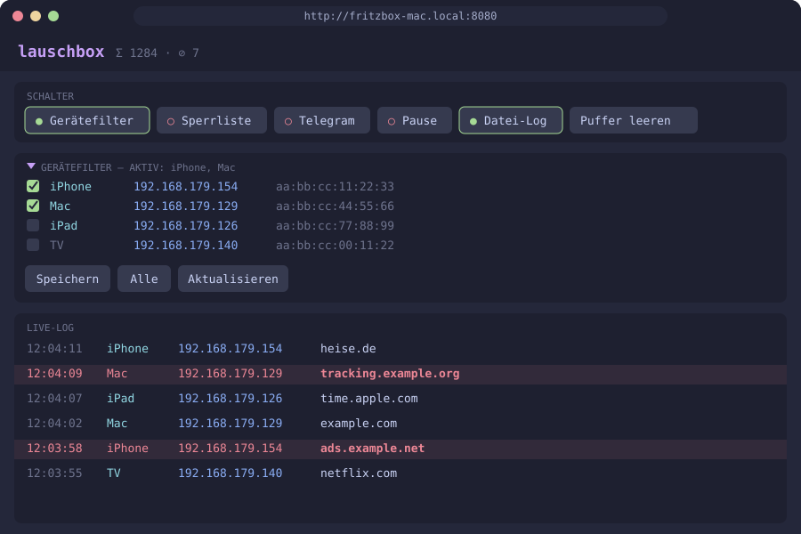

# lauschbox 📡

<p align="center"></p>

**DNS-Live-Log für die FRITZ!Box im Terminal** — mit Gerätefilter, Sperrliste,
Telegram-Alarm bei Treffern und Statistik.

Die FRITZ!Box hat kein natives DNS-Query-Log. lauschbox zapft deshalb die
Paketaufzeichnung der Box an und filtert daraus mit `tshark` die DNS-Anfragen
heraus. Es läuft komplett lokal auf deinem Rechner, es wird nichts auf der
Box installiert.

- 📡 **Live-Log:** Zeit · Gerät · IP · Domain, scrollbar, mit Pause und Sparkline
- 📱 **Gerätefilter:** nur ausgewählte Geräte mitschneiden
- 🚫 **Sperrliste:** Treffer rot markiert, optional „nur Treffer zeigen“
- ✈️ **Telegram:** Push bei jedem Treffer (mit Cooldown gegen Flut)
- 📊 **Statistik:** Top-Domains, aktivste Geräte, Treffer
- 📝 **Datei-Log:** Mitschnitt per Tastendruck in eine Textdatei
- 🌐 **Web-UI:** Schalter, Geräteauswahl und Live-Log im Browser (Taste `w`, auch mobil)
- 🎨 Catppuccin-Macchiato-Farben, passt sich der Terminalgröße an

## Screenshots

Hauptmenü:

```
 _                      _     _
| | __ _ _   _ ___  ___| |__ | |__   _____  __
| |/ _` | | | / __|/ __| '_ \| '_ \ / _ \ \/ /
| | (_| | |_| \__ \ (__| | | | |_) | (_) >  <
|_|\__,_|\__,_|___/\___|_| |_|_.__/ \___/_/\_\
  DNS-Lauscher für die FRITZ!Box

  Fritzbox    ● 192.168.179.1 (benutzer)
  Telegram    ● konfiguriert
  Filter      iPhone
  Sperrliste  ● 104 Domains
  Logdatei    ~/.config/lauschbox/dns.log (Standard)

     1  🔌  Verbindung Fritzbox
     2  ✈️   Verbindung Telegram
     3  📱  Gerätefilter
   ▸ 4  📡  DNS Logging
     5  🚫  Sperrliste anzeigen
     6  📊  Statistik
     7  📝  Logdatei Pfad
     8  🌐  Web-UI Port
     9  👋  Ende

  ↑/↓ wählen · Enter öffnen · 1-9 direkt · q Ende
```

DNS-Logging (Treffer der Sperrliste mit rotem `▌` am Rand):

```
   17:57:21 Mac          192.168.179.129 heise.de
   17:57:21 Mac          192.168.179.129 example.com
 ▌ 17:57:21 Mac          192.168.179.129 pornhub.com
   17:57:24 iPad         192.168.179.126 iPad.local
   17:57:31 iPhone       192.168.179.154 time.apple.com

 ── 📱 iPhone, Mac  ·  1-lan ─────────────────────────────────────────────
 ● LIVE  ▁▁▁▁▁▁▁█▁▁▆  Σ 9 · 🚫 1 · 0.9/s
 g Gerätefilter ●  e ändern  s Sperrliste ○  t Telegram ○  p Pause ○  l Datei ○  w Web ○  c leeren  x Menü
```

## Voraussetzungen

### FRITZ!Box einrichten

1. **Benutzer mit Passwort anlegen** (nicht „nur Kennwort“):
   *System → FRITZ!Box-Benutzer → Benutzer hinzufügen*, Recht
   **„FRITZ!Box Einstellungen“**.
2. **TR-064 freischalten** (für die Geräteliste):
   *Heimnetz → Netzwerk → Netzwerkeinstellungen → „Zugriff für Anwendungen zulassen“*.

### Werkzeuge

| Tool | macOS (Homebrew) | Debian/Ubuntu |
|---|---|---|
| curl | `brew install curl` | `sudo apt-get install curl` |
| tshark | `brew install wireshark` | `sudo apt-get install tshark` |
| python3 | `brew install python` | `sudo apt-get install python3` |
| figlet *(optional, für das große Banner)* | `brew install figlet` | `sudo apt-get install figlet` |

Fehlende Pflicht-Tools meldet lauschbox beim Start inkl. Installationsbefehl.
Ohne `figlet` läuft alles, nur mit einzeiligem Kopf statt Banner. Bash ≥ 3.2
genügt (auch das macOS-System-Bash). Root-Rechte sind nicht nötig.

## Installation

Einzeiler (macOS & Linux) — legt das Script nach `~/.local/bin`, die
Konfiguration nach `~/.config/lauschbox`:

```bash
curl -fsSL https://forbidden-fruits.github.io/lauschbox/install.sh | sh
```

Oder manuell:

```bash
git clone <repo-url> lauschbox
cd lauschbox
chmod +x lauschbox
./lauschbox
```

Stelle sicher, dass `~/.local/bin` in deinem `PATH` liegt, wenn du nach dem
Einzeiler einfach `lauschbox` tippen willst.

## Schnellstart

1. `lauschbox` starten.
2. **[1] Verbindung Fritzbox:** IP, Benutzer, Passwort eingeben. Die Zugangsdaten
   werden gleich per Login getestet.
3. *(optional)* **[2] Verbindung Telegram:** Bot-Token und Chat-ID eingeben, es
   geht eine Testnachricht raus.
4. **[3] Gerätefilter:** Geräte auswählen, die mitgeschnitten werden sollen.
5. **[4] DNS Logging** — los geht’s.

Kommandozeile:

```
lauschbox [Option]
  -l, --log        direkt in die DNS-Logging-Ansicht starten
      --no-color   ohne Farben (auch via NO_COLOR=1)
  -V, --version    Version anzeigen
  -h, --help       Hilfe
```

lauschbox braucht ein interaktives Terminal (TTY).

## Bedienung

### Hauptmenü

Auswahl mit `↑`/`↓` + `Enter`, per Zifferntaste `1`–`9` direkt oder `q` zum
Beenden. Das Dashboard oben zeigt den Konfigurationsstand.

| # | Punkt | Funktion |
|---|---|---|
| 1 | 🔌 Verbindung Fritzbox | IP/Benutzer/Passwort eingeben, mit Login-Test |
| 2 | ✈️ Verbindung Telegram | Bot-Token/Chat-ID eingeben, mit Test-Nachricht |
| 3 | 📱 Gerätefilter | Geräte per Checkbox auswählen |
| 4 | 📡 DNS Logging | Live-Ansicht |
| 5 | 🚫 Sperrliste anzeigen | `blocklist.txt` scrollbar ansehen |
| 6 | 📊 Statistik | Auswertung der laufenden Sitzung |
| 7 | 📝 Logdatei Pfad | Ziel des Datei-Logs festlegen |
| 8 | 🌐 Web-UI Port | Port der Web-UI setzen (Standard `8080`) |
| 9 | 👋 Ende | Beenden |

### Gerätefilter

Lädt alle der Box bekannten Geräte (online `●` und offline `○`, WLAN 📶,
LAN 🔌, Gast 👥) und zeigt sie als Checkbox-Liste.

| Taste | Funktion |
|---|---|
| `↑`/`↓`, `PgUp`/`PgDn`, `Home`/`Ende`, Mausrad | navigieren |
| `Leertaste` | Gerät an-/abwählen |
| `a` | alle Netzwerkgeräte (kein Filter), sofort speichern |
| `n` | Auswahl löschen |
| `Enter` | speichern |
| `q` / `Esc` | abbrechen |

Ohne Auswahl wird „Alle Netzwerkgeräte“ gespeichert. Der Filter arbeitet über
die MAC-Adresse, gilt also für IPv4 **und** IPv6.

### DNS Logging

Pro Zeile: **Uhrzeit · Gerätename · IP · Domain**. Sperrlisten-Treffer sind
rot/fett und mit `▌` markiert. Unten zeigt die Statusleiste `● LIVE`,
eine Sparkline der Anfragen pro Sekunde, die Zähler (Σ gesamt, 🚫 Treffer) und
die aktuelle Rate; darunter die Tastenleiste mit `●` (an) / `○` (aus) je Schalter.

| Taste | Funktion |
|---|---|
| `g` | Gerätefilter an/aus (aus = alle Geräte) |
| `e` | Gerätefilter ändern |
| `s` | Sperrliste an/aus (an = **nur Treffer** anzeigen) |
| `t` | Telegram an/aus (nur bei aktiver Sperrliste) |
| `p` | Pause / zurück zur Live-Ansicht |
| `l` | Datei-Log an/aus |
| `w` | Web-UI an/aus (Schalter, Geräteauswahl und Live-Log im Browser; Port siehe `WEB_PORT`) — **ohne Authentifizierung, lauscht auf allen Interfaces** |
| `c` | Puffer und Zähler leeren |
| `x` / `q` | zurück zum Hauptmenü |
| `↑`/`↓`, `PgUp`/`PgDn`, `Home`, Mausrad | scrollen |
| `Ende` | zurück zum Live-Ende |

**Scrollen und Pause:** Sobald du hochscrollst (oder `p` drückst), friert die
Ansicht ein. Neue Einträge werden im Hintergrund weiter gesammelt und in der
Statusleiste gezählt (`⏸ PAUSE (+12 neu)`). `Ende` oder `p` bringt dich zurück
ins Live-Log.

**Doppelte Anfragen:** Geräte fragen dieselbe Domain oft mehrfach in Folge
(A/AAAA/HTTPS). Identische Anfragen (Gerät + Domain) innerhalb von 2 Sekunden
werden nur einmal angezeigt (`DEDUPE_SECS`).

**Verbindungsabbruch:** Bricht die Aufzeichnung ab (Box-Neustart, WLAN-Wechsel),
meldet sich lauschbox automatisch neu an (Wartezeit 2 s, verdoppelt bis max.
60 s). Die Statusleiste zeigt dann `↻ RECONNECT`.

**Terminalgröße:** Die Ansicht passt sich beim Verändern der Fenstergröße an.
Bei kleinen Fenstern wird das Banner zur Kopfzeile, die Tastenleiste kürzer.

### Sperrliste

Sperrlisten-Datei `blocklist.txt` (Suchreihenfolge siehe
[Konfiguration](#konfiguration)):

```text
# Kommentar
example.com
tracking.example.org
*.ads.example.net
0.0.0.0 telemetry.example.com
```

- eine Domain pro Zeile, `#` leitet einen Kommentar ein (auch am Zeilenende)
- **Subdomains matchen automatisch:** `example.com` trifft auch `www.example.com`
- Groß-/Kleinschreibung und ein führendes `*.` bzw. `.` spielen keine Rolle
- **hosts-Format** (`0.0.0.0 domain`, `127.0.0.1 domain`) wird verstanden,
  fertige Blocklisten lassen sich also direkt verwenden; reine IP-Zeilen
  werden ignoriert
- Änderungen werden beim Einschalten der Sperrliste (`s`) neu eingelesen

Im Log-Betrieb wirkt die Sperrliste so:

| Zustand | Anzeige |
|---|---|
| `s` aus | alle Anfragen, Treffer rot |
| `s` an | **nur** Treffer; Telegram (`t`) kann zugeschaltet werden |

Menü **[5] Sperrliste anzeigen** zeigt die Datei scrollbar (Kommentare grau).

### Telegram

1. Bot bei [@BotFather](https://t.me/BotFather) anlegen (`/newbot`) → Token
   im Format `123456789:AA…`.
2. **Dem Bot einmal `/start` schicken**, sonst darf er dir nicht schreiben.
3. Chat-ID ermitteln: [@userinfobot](https://t.me/userinfobot) anschreiben,
   oder dem Bot schreiben und `https://api.telegram.org/bot<TOKEN>/getUpdates`
   öffnen → `result[].message.chat.id`. Gruppen haben negative IDs (der Bot
   muss Mitglied sein).
4. In lauschbox **[2]** eintragen. Der Token wird verdeckt eingegeben; eine
   Testnachricht bestätigt die Einrichtung bzw. zeigt den Fehler von Telegram.

Im Log: Sperrliste `s` an, dann `t`. Jeder Treffer löst eine Nachricht aus:

```
🚨 lauschbox: Sperrlisten-Treffer
Gerät: Mac (192.168.179.129)
Domain: pornhub.com
Zeit: 17:57:21
```

Derselbe Treffer (Gerät + Domain) wird höchstens alle 30 Sekunden gemeldet
(`NOTIFY_COOLDOWN`).

### Statistik

Menü **[6]** wertet die laufende Sitzung aus: Anzahl Anfragen/Treffer/Geräte/
Domains, Top-Domains, aktivste Geräte und Top-Treffer als Balkendiagramm.
Die Daten gelten nur bis zum Beenden von lauschbox; `c` im Log setzt sie
zurück.

### Datei-Log

`l` im Log schreibt jede angezeigte Anfrage zusätzlich in eine Textdatei
(Standard `~/.config/lauschbox/dns.log`, änderbar über Menü **[7]** oder `LOG_FILE`):

```
2026-09-30 17:57:21 Mac 192.168.179.129 heise.de
2026-09-30 17:57:21 Mac 192.168.179.129 pornhub.com [TREFFER]
```

Die Datei wird angehängt, nicht rotiert.

### Web-UI

Alternativ zu den Tasten im Terminal lässt sich lauschbox im Browser bedienen –
auch vom Handy im selben Netz. Die Web-UI läuft nur, solange das DNS-Logging aktiv ist.

**Einschalten**

1. DNS-Logging starten (Menü **[4]** oder `lauschbox -l`)
2. `w` drücken – die Statusleiste zeigt `w ●` und die Adresse
3. Im Browser `http://<Rechnername>:8080` öffnen

Der Port ist über Menü **[8]** oder `WEB_PORT` in der `lauschbox.env` änderbar (1024–65535).

<p align="center"></p>

**Was sie kann**

| Bereich | Funktion |
|---|---|
| Schalter | Gerätefilter, Sperrliste, Telegram, Pause, Datei-Log, „Puffer leeren“ – wirken wie die Tasten `g` `s` `t` `p` `l` `c` |
| Geräteauswahl | Checkbox-Liste der Geräte; „Speichern“ übernimmt den Filter (schreibt `.devices.env`), „Alle“ hebt ihn auf |
| Live-Log | neueste Einträge oben, Treffer rot, bis zu 500 Zeilen |

Terminal und Browser sind synchron: Änderungen im Browser greifen sofort, Änderungen im
Terminal erscheinen dort nach spätestens 2 Sekunden. Telegram lässt sich im Browser nur
schalten, wenn es konfiguriert und die Sperrliste aktiv ist.

> ⚠️ Die Web-UI hat **keine Authentifizierung** und lauscht auf allen Interfaces –
> nur im vertrauenswürdigen Heimnetz einschalten.

## Konfiguration

### Dateien und Suchreihenfolge

lauschbox sucht jede Datei **zuerst im aktuellen Verzeichnis**, danach unter
`~/.config/lauschbox/`. Neu angelegte Dateien landen dort, wo sie gefunden
wurden, sonst in `~/.config/lauschbox/`.

| Datei | Inhalt | Angelegt durch |
|---|---|---|
| `.fritzbox.env` | `FB_IP`, `FB_USER`, `FB_PASS` | Menü [1] |
| `.telegram.env` | `TG_TOKEN`, `TG_CHAT_ID` | Menü [2] |
| `.devices.env` | `DEVICE_FILTER` (MACs, kommagetrennt, oder `ALL`), `DEVICE_FILTER_NAMES` | Menü [3] |
| `blocklist.txt` | Sperrliste | Installer / von Hand |
| `lauschbox.env` | Einstellungen (s. u.) | Installer / von Hand / Menü [7] (`LOG_FILE`) |
| `dns.log` | Datei-Log | Taste `l` |

Die `.env`-Dateien werden mit Rechten `600` gespeichert. Sie enthalten
Klartext-Zugangsdaten — **nicht committen** (im Repo bereits per `.gitignore`
ausgeschlossen). Die Dateien werden nur gelesen, nie als Shell-Code ausgeführt;
Format: `NAME='wert'` oder `NAME="wert"`, eine Variable pro Zeile.

### `lauschbox.env` — Einstellungen

Alle Werte sind optional. Fehlt die Datei oder ist ein Wert ungültig, gilt der
Standard.

```bash
# lauschbox Einstellungen

# Zeilen im Ringpuffer der Logging-Ansicht (Scrollback)
LOG_MAX_LINES=1000
# Maximal angezeigte Zeilen in der Sperrlisten-Ansicht
BLOCKLIST_MAX_LINES=1000
# Schnittstelle der Fritzbox-Aufzeichnung
CAPTURE_IFACE=1-lan
# Identische Anfragen (Gerät+Domain) innerhalb n Sekunden ausblenden; 0 = aus
DEDUPE_SECS=2
# Telegram: gleicher Treffer frühestens nach n Sekunden erneut melden; 0 = aus
NOTIFY_COOLDOWN=30
# Geräteliste (Namensauflösung) alle n Sekunden auffrischen; 0 = aus
DEVICE_REFRESH_SECS=300
# Port der Web-UI (Taste w im Logging), 1024-65535
WEB_PORT=8080
# Ziel des Datei-Logs (Taste l)
LOG_FILE=/Users/dein-name/.config/lauschbox/dns.log
```

| Variable | Standard | Bedeutung |
|---|---|---|
| `LOG_MAX_LINES` | `1000` | Größe des Scrollback-Puffers im Log; ältere Zeilen fallen heraus |
| `BLOCKLIST_MAX_LINES` | `1000` | Obergrenze der Anzeige unter Menü [5]; die Sperrliste selbst wird vollständig ausgewertet |
| `CAPTURE_IFACE` | `1-lan` | Aufzeichnungs-Interface. Nur nötig, wenn du z. B. das Internet-Interface der Box mitschneiden willst |
| `DEDUPE_SECS` | `2` | Zeitfenster für die Duplikat-Unterdrückung |
| `NOTIFY_COOLDOWN` | `30` | Mindestabstand gleicher Telegram-Meldungen |
| `DEVICE_REFRESH_SECS` | `300` | Intervall für die Auffrischung der Gerätenamen im Hintergrund |
| `WEB_PORT` | `8080` | Port der Web-UI (1024–65535), änderbar über Menü **[8]** |
| `LOG_FILE` | `~/.config/lauschbox/dns.log` | Pfad des Datei-Logs — **absoluter Pfad**, `~` und `$HOME` werden in der `.env` nicht aufgelöst |

Farben abschalten: `--no-color` oder `NO_COLOR=1`.

## Bekannte Grenzen

lauschbox sieht nur DNS-Anfragen, die **bei der Fritzbox ankommen**:

- **DNS-Cache:** Wiederholte Aufrufe erzeugen oft keine neue Anfrage.
- **Verschlüsseltes DNS** (DoH/DoT im Browser), **iCloud Private Relay** und
  **VPN-Clients** umgehen die Box und bleiben unsichtbar.
- Es wird die Anfrage (Domain) geloggt, nicht der Seiteninhalt.
- Telegram ist Best-Effort; bei extremer Flut kann Telegram drosseln (HTTP 429).
- Während lauschbox läuft, ist auf der Box eine Paketaufzeichnung aktiv. Beim
  Beenden (auch per `Ctrl-C`) wird sie wieder gestoppt.

## Troubleshooting

| Problem | Lösung |
|---|---|
| Login fehlgeschlagen | Benutzer mit Passwort statt „nur Kennwort“; Recht „FRITZ!Box Einstellungen“; nach Fehlversuchen die BlockTime der Box abwarten |
| Geräteliste leer / nicht ladbar | TR-064 freigeschaltet („Zugriff für Anwendungen zulassen“)? Richtige IP? |
| Domain fehlt im Log | Gerätefilter aktiv (`g` drücken)? DNS-Cache? DoH/Private Relay/VPN am Gerät? |
| Zeilen mit `?xx:xx` statt Gerätename | Gerät ist der Box nicht namentlich bekannt; Anzeige ist das Ende der MAC-Adresse |
| Keine Telegram-Nachricht | Bot per `/start` kontaktiert? Chat-ID korrekt? Sperrliste (`s`) **und** Telegram (`t`) an? Cooldown? |
| Sperrliste „fehlt oder leer“ | `blocklist.txt` im aktuellen Verzeichnis oder unter `~/.config/lauschbox/` anlegen |
| Ständig `↻ RECONNECT` | Box erreichbar? Passwort geändert? Ggf. läuft parallel eine andere Aufzeichnung auf der Box |
| Terminal nach Absturz kaputt | `reset` bzw. `stty sane` eingeben |

## Website

<https://forbidden-fruits.github.io/lauschbox/>

## Lizenz

[MIT](LIZENZ.txt)
